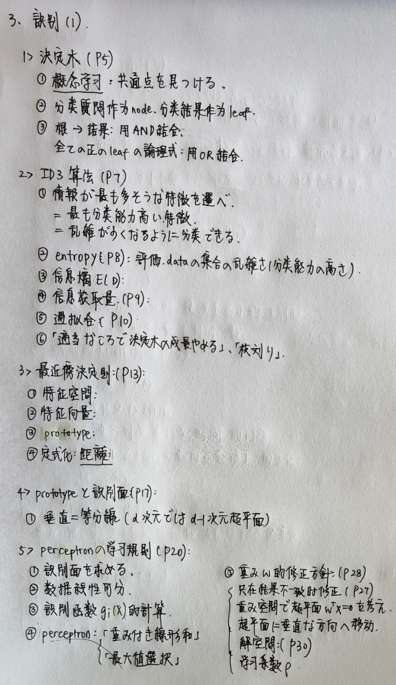
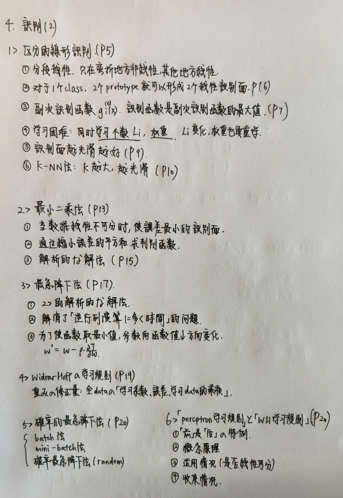
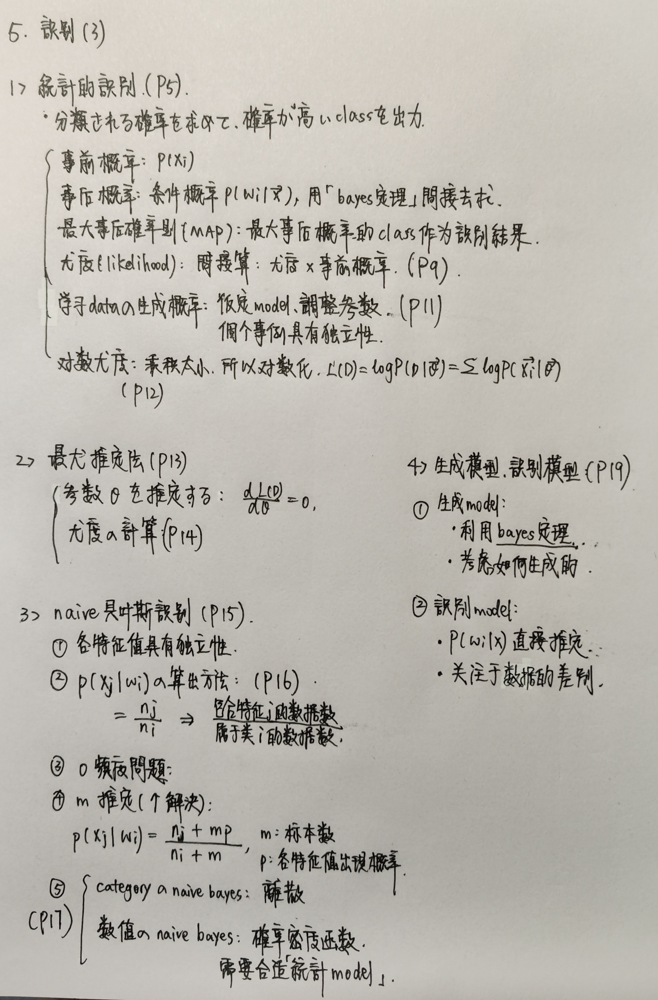

<!-- Created by Frank -->

- [机器学习\_概念\_1](#机器学习_概念_1)
  - [1 機械学習とは](#1-機械学習とは)
    - [⼈⼯知能](#知能)
    - [機械学習](#機械学習)
    - [深層学習](#深層学習)
    - [機械学習の基本的な定義](#機械学習の基本的な定義)
    - [教師あり学習](#教師あり学習)
    - [識別](#識別)
    - [回帰](#回帰)
    - [教師なし学習](#教師なし学習)
    - [モデル推定](#モデル推定)
    - [パターンマイニング](#パターンマイニング)
    - [中間的学習](#中間的学習)
    - [半教師あり学習](#半教師あり学習)
    - [強化学習](#強化学習)
  - [2 機械学習の基本的な⼿順](#2-機械学習の基本的な順)
    - [機械学習の流れ (P4)](#機械学習の流れ-p4)
    - [機械学習に⽤いる学習データは多次元ベクトル (P5)](#機械学習にいる学習データは多次元ベクトル-p5)
    - [「次元の呪い」(P7)](#次元の呪いp7)
    - [汎化能⼒（または汎化性能）(P7)](#汎化能または汎化性能p7)
    - [前処理: 次元削減 (P7)](#前処理-次元削減-p7)
    - [主成分分析（PCA）(P8)](#主成分分析pcap8)
    - [対⾓成分, ⾮対⾓成分 (P10)](#対成分-対成分-p10)
    - [半正定値, 対称⾏列 (P11)](#半正定値-対称列-p11)
    - [固有値の⼤きい順に、それに対応する固有ベクトルの⽅向 (P11)](#固有値のきい順にそれに対応する固有ベクトルの向-p11)
    - [累積寄与率 (P13)](#累積寄与率-p13)
    - [標準化 (P14)](#標準化-p14)
    - [評価基準の設定: 分割学習法 (P16)](#評価基準の設定-分割学習法-p16)
    - [評価基準の設定: 交差確認法 (P17)](#評価基準の設定-交差確認法-p17)
    - [学習: k-NN法 (P18)](#学習-k-nn法-p18)
    - [K‐NN法で調整するべきパラメータ (P18)](#knn法で調整するべきパラメータ-p18)
    - [結果の可視化: 混同⾏列 (P20)](#結果の可視化-混同列-p20)
    - [結果の可視化: 評価指標 (P21)](#結果の可視化-評価指標-p21)
    - [精度と再現率はトレードオフ (trade off) の関係 (P23)](#精度と再現率はトレードオフ-trade-off-の関係-p23)
    - [結果の可視化: ROC曲線 (P24)](#結果の可視化-roc曲線-p24)
    - [マクロ平均 宏平均 (P27)](#マクロ平均-宏平均-p27)
    - [マイクロ平均 微平均 (P27)](#マイクロ平均-微平均-p27)
    - [マクロ平均, マイクロ平均 (P27)](#マクロ平均-マイクロ平均-p27)
  - [3 識別（１）](#3-識別１)
    - [教師あり識別問題 (P4)](#教師あり識別問題-p4)
    - [概念学習 (P5)](#概念学習-p5)
    - [決定⽊ (P5)](#決定-p5)
    - [決定⽊の学習: ID3アルゴリズム (P7)](#決定の学習-id3アルゴリズム-p7)
    - [エントロピー (P8)](#エントロピー-p8)
    - [情報獲得量 (P9)](#情報獲得量-p9)
    - [過学習 (P10)](#過学習-p10)
    - [特徴空間 (P13)](#特徴空間-p13)
    - [特徴ベクトル (P13)](#特徴ベクトル-p13)
    - [最近傍決定則（nearest neighbor法、NN法）(P14)](#最近傍決定則nearest-neighbor法nn法p14)
    - [最近傍決定則における識別⾯ (P18)](#最近傍決定則における識別-p18)
    - [パーセプトロンの学習規則 (P20)](#パーセプトロンの学習規則-p20)
    - [Perceptron (P24)](#perceptron-p24)
    - [識別関数の学習 (P25)](#識別関数の学習-p25)
    - [識別関数 g(x) の値の意味 (P26)](#識別関数-gx-の値の意味-p26)
    - [重みを調整 (P27)](#重みを調整-p27)
    - [重みの修正方針 (P28)](#重みの修正方針-p28)
      - [重み空間で超平⾯ WTX = 0 を考える](#重み空間で超平-wtx--0-を考える)
      - [誤識別が⽣じたときのみ重みを修正, 超平⾯に垂直な⽅向へ移動させるのが最も近道](#誤識別がじたときのみ重みを修正-超平に垂直な向へ移動させるのが最も近道)
      - [データが変われば、前のデータとは異なる超平⾯となる](#データが変われば前のデータとは異なる超平となる)
    - [解領域 (P30)](#解領域-p30)
    - [学習係数 rou (P30)](#学習係数-rou-p30)
    - [パーセプトロンの学習規則のアルゴリズム (P31) ](#パーセプトロンの学習規則のアルゴリズム-p31-)
  - [4 識別（２）](#4-識別２)
    - [パーセプトロンの学習規則 (P5)](#パーセプトロンの学習規則-p5)
    - [区分的線形 (P5)](#区分的線形-p5)
    - [副次識別関数 (P7)](#副次識別関数-p7)
    - [区分的線形識別関数の学習は難しい (P8)](#区分的線形識別関数の学習は難しい-p8)
    - [最も複雑な識別⾯ (P9)](#最も複雑な識別-p9)
    - [クラスの識別面は滑らかな形の方が良さそう (P9)](#クラスの識別面は滑らかな形の方が良さそう-p9)
    - [k-NN 法 (P10)](#k-nn-法-p10)
    - [最⼩⼆乗法 (P12)](#最乗法-p12)
    - [最急降下法 (P17)](#最急降下法-p17)
    - [Widrow‐Hoffの学習規則 (P19)](#widrowhoffの学習規則-p19)
    - [バッチ法 (P20)](#バッチ法-p20)
    - [ミニバッチ法 (P20)](#ミニバッチ法-p20)
    - [確率的最急降下法 (P20)](#確率的最急降下法-p20)
    - [パーセプトロンの学習規則は、Widrow‐Hoffの学習規則の特殊なケース (P21)](#パーセプトロンの学習規則はwidrowhoffの学習規則の特殊なケース-p21)
    - [パーセプトロンの学習規則 と　Widrow‐Hoffの学習規則 (P22 - 23)](#パーセプトロンの学習規則-とwidrowhoffの学習規則-p22---23)
  - [5 識別（3）](#5-識別3)
    - [統計的識別 (P5)](#統計的識別-p5)
    - [事前確率 (P6)](#事前確率-p6)
    - [事後確率 (P7)](#事後確率-p7)
    - [最⼤事後確率則 MAP (P7)](#最事後確率則-map-p7)
    - [事後確率の求め⽅ (P8)](#事後確率の求め-p8)
    - [尤度（likelihood）(P9)](#尤度likelihoodp9)
    - [学習データの⽣成確率 (P11)](#学習データの成確率-p11)
    - [対数尤度 (P12)](#対数尤度-p12)
    - [最尤推定法 (P13)](#最尤推定法-p13)
    - [尤度の計算 (P14)](#尤度の計算-p14)
    - [ナイーブベイズ識別 (P15)](#ナイーブベイズ識別-p15)
    - [ゼロ頻度問題 (P16)](#ゼロ頻度問題-p16)
    - [m 推定 (P16)](#m-推定-p16)
    - [数値特徴に対するナイーブベイズ識別 (P17)](#数値特徴に対するナイーブベイズ識別-p17)
    - [⽣成モデル (P19)](#成モデル-p19)
    - [識別モデル (P19)](#識別モデル-p19)

# 机器学习_概念_1

## 1 機械学習とは

### ⼈⼯知能

* 現在、⼈が⾏っている知的な判断を代わりに⾏う技術

### 機械学習

* 簡単に規則化できない複雑な⼤量のデータ （ビッグデータ、Bigdata） から有⽤な知⾒を得るための処理
* ⼈⼯知能の技術を実現するための⼀つの⽅法

### 深層学習

* 中間層を多くもつニューラルネットワークによって実装
* 機械学習⼿法の⼀つで、深い階層構造 （多段階の⾮線形変換） によって、与えられた問題に適したデータの表現法を獲得

### 機械学習の基本的な定義

* アルゴリズムとして明⽰的に解法が与えられていないタスクを遂⾏するためのモデルを学習データから構築すること
* タスク: 機械学習が対象とする問題
* 学習データ: モデルを構築するために⽤いるデータ

### 教師あり学習

* 正解の付いた学習データを⽤いた学習
* ⽬的は、⼊⼒𝒙を正解𝑦に写像する関数𝑐を推定すること

### 識別

* ⼊⼒をあらかじめ定められたクラスのいずれかに分類する問題

### 回帰

* ⼊⼒から予想される妥当な出⼒値を求める問題

### 教師なし学習

* 正解が付いていない学習データを⽤いた学習
* ⽬的は、⼊⼒データに潜む規則性を学習すること

### モデル推定

* 「⼊⼒データ全体を⽀配する規則性」を学習によって推定する問題
* ⼊⼒データから何らかの共通点をもつデータをまとめること

### パターンマイニング

* 「⼊⼒データの部分集合内、あるいはデータの部分集合間に成り⽴つ規則性」を発⾒する問題
* ⼤量のデータから、何度も出現するパターンや、そのパターンに基づいた規則を発⾒すること
* 条件部と結論部から構成
* パターンマイニングの敵は膨⼤な計算量

### 中間的学習

* 中間的学習を「教師あり学習・教師なし学習のいずれにも該当しない⼿法」と定義

### 半教師あり学習

* 正解付きデータから得られた識別器の性能を、正解なしデータを使って向上させる⼿法

### 強化学習

* ⼀連の⾏動を通じて、最も多くの報酬を得られるように、各状態における最適な出⼒を獲得させる学習⼿法
* ロボットに試⾏錯誤を繰り返させながら、ゴールに到着したときだけ報酬を与える

## 2 機械学習の基本的な⼿順

### 機械学習の流れ (P4)

* データ収集・整理
* 前処理
* 評価基準の設定
* 学習
* 結果の可視化

### 機械学習に⽤いる学習データは多次元ベクトル (P5)

* 多次元ベクトルの集合を機械可読な形式で表現する
* 最も簡単な⽅法 CSV（Commna Speparated Values）形式。ベクトルの各要素をカンマで区切り、1⾏に1事例ずつ並べる

### 「次元の呪い」(P7)

* ⾼次元空間上に、学習データが疎らに存在することになり、そのようなデータから得られたモデルの汎化能⼒が低い

### 汎化能⼒（または汎化性能）(P7)

* 学習段階で⾒たことのない⼊⼒に対して、良い結果を出⼒できる
* 学習データから、⼀般化されたモデルが獲得されている

### 前処理: 次元削減 (P7)

* 特徴ベクトルの次元数を減らすこと
* 汎化能⼒の⾼いモデルを学習する上で重要な前処理

### 主成分分析（PCA）(P8)

* 相関が⾼い特徴を含むような冗⻑な⾼次元空間を、冗⻑性の少ない低次元空間に写像する⾏列を求める操作
* steps: 
  * 共分散⾏列Σの計算
  * 固有値と固有ベクトルの計算
  * 固有ベクトルを⽤いて次元削減

### 対⾓成分, ⾮対⾓成分 (P10)

* 対⾓成分: 次元ごとの分散（データの散らばり具合）
* ⾮対⾓成分: 次元間の相関

### 半正定値, 対称⾏列 (P11)

* 半正定値: 固有値がすべて0以上の実数
* 対称⾏列: 固有ベクトルが実数かつ直交

### 固有値の⼤きい順に、それに対応する固有ベクトルの⽅向 (P11)

* データの散らばりが⼤きい⽅向
* ⾔い換えると、識別するにあたって情報が多い⽅向

### 累積寄与率 (P13)

* 累计贡献率 用于表示元数据信息保留程度
* 「すべての固有値の和」に対する「採⽤した軸の固有値の和」の⽐
* 主成分分析によって構成した軸では、対応する固有値が分散になるので、累積寄与率によって「次元削減後の空間が、もとのデータの情報をどの程度保存しているのか」を表現できる

### 標準化 (P14)

* 特徴の値の範囲を揃える操作
* これをベクトルとして組み合わせて、そのまま学習を⾏うと、絶対値の⼤きい特徴量の寄与が⼤きくなりすぎるので、事前に各次元での値のスケールを合わせる必要がある

### 評価基準の設定: 分割学習法 (P16)

* 半分を学習⽤、残り半分を評価⽤として分割する⽅法

### 評価基準の設定: 交差確認法 (P17)

* 学習データを𝑚個の集合に分割し、そのうちの m-1 個で学習し、除外した残りの⼀つで評価する

### 学習: k-NN法 (P18)

* ⼊⼒されたデータに近い学習データを近い順にk個選び、多数決などで所属クラスを決定する⼿法
* ⾳声対話アプリで実現されている発話理解⼿法の⼀部に k-NN 法の考え⽅に近いものが採⽤されている

### K‐NN法で調整するべきパラメータ (P18)

* 近傍として探索するデータ数 k
* 距離尺度
* 探索⽅法
  * 通常は、⼊⼒と全データとの距離を計算して並べ替える

### 結果の可視化: 混同⾏列 (P20)

* 対⾓成分が正解数、⾮対⾓成分が間違いの数を⽰す

### 結果の可視化: 評価指標 (P21)

* 正解率（Accuracy）
  * 識別器が正しい答えを出した割合
* 精度（precision）
  * 識別器が正と判断したときに、どれだけ信頼できるか︖
* 再現率（recall）
  * 正例がどれだけ正しく判定されているか︖
* F値
  * 精度と再現率の調和平均

### 精度と再現率はトレードオフ (trade off) の関係 (P23)

* 正样本越多，精度降低，召回率升高
* 负样本越多，精度升高，召回率降低

### 結果の可視化: ROC曲線 (P24)

* FPR（false positive rate）
  * FPR = FP / 负例数
* TPR（true positive rate）
  * TPR = TP / 正例数
* 完璧な識別器までの近さは、ROC曲線の下側の⾯積（area under ROC curve; AUR）で評価する。
* 完璧な識別器は AUR = 1、ランダム識別器は AUR = 0.5
* AUR が 1 に近いほど、よい識別器である。越接近1越好

### マクロ平均 宏平均 (P27)

* クラスごとの精度や再現率を求め、その平均を計算する

### マイクロ平均 微平均 (P27)

* 各クラスでの混同⾏列を作成し、それらを集計する

### マクロ平均, マイクロ平均 (P27)

* 各クラスの事例数の違いが⼤きいときは、マイクロ (micro) 平均
* または事例数で重みをつけたマクロ (macro) 平均を⽤いる

## 3 識別（１）

### 教師あり識別問題 (P4)

* カテゴリデータ、または数値データからなる特徴ベクトルを⼊⼒して、それをクラス分けする識別器を作る

### 概念学習 (P5)

* 個々の事例から、あるクラスについて共通点をみつける学習⼿法
* その学習⼿法の代表例が決定⽊

### 決定⽊ (P5)

* データを分類する質問をノード(節)とし、分類結果をリーフ(葉)とする⽊構造の概念表現
* 根から分類結果が正である葉に⾄る節の分岐の値を AND 条件で結合
* 全ての正の葉に関して、そのように得られた論理式を OR 条件で結合

### 決定⽊の学習: ID3アルゴリズム (P7)

* 決定⽊を作成する基本的な⼿順
* 全ての特徴の中から、得られる情報が最も多そうな特徴を最初の質問として選択
* 上面の質問によって、学習データをいくつかの部分集合に分割

### エントロピー (P8)

* データ集合の乱雑さ（分類能⼒の⾼さ）の評価
* エントロピーの値が⼩さいほど、集合が乱雑ではない（同じクラスのものが⼤半を占めている）ということを⽰す

### 情報獲得量 (P9)

* 特徴値に基づく分類によるエントロピーの減少量
* その特徴を選択することによって得られる情報の⼤きさ
* 情報獲得量が⼤きい特徴を選んでデータを分割する

### 過学習 (P10)

* モデルが学習データに特化しすぎたために、未知データに対して性能が下がる現象
* ⼀般的に⼩さい⽊を実現させることは難しい
* 「適当なところで決定⽊の成⻑を⽌める⽅法」や「完全に学習させたあと、枝刈りする⽅法」で過学習に対処する必要がある

### 特徴空間 (P13)

* この d 次元空間を特徴空間と呼ぶ

### 特徴ベクトル (P13)

* 特徴ベクトルは特徴空間上の1点を表す

### 最近傍決定則（nearest neighbor法、NN法）(P14)

* ⼊⼒特徴ベクトル が属するクラスを判定する簡単な⽅法
* ⼊⼒特徴ベクトルと各クラスのプロトタイプ (prototype) の距離を⽐較

### 最近傍決定則における識別⾯ (P18)

* 特徴ベクトル がプロトタイプから等距離にある線
  * つまり、垂直⼆等分線 ( d 次元では垂直⼆等分 d - 1 次元超平⾯)
* プロトタイプの位置によって、正しい/間違った識別⾯が設定されることに注意
* 線形の識別⾯でクラスを分離できる場合を線形分離可能と呼ぶ

### パーセプトロンの学習規則 (P20)

* 学習データから識別⾯を求めるアルゴリズムの1つ
* (P22) 特徴ベクトル を⼊⼒し、各クラス wi に対応する識別関数 g(x) を計算して、最⼤値をとるクラス wk を選択
* 「最近傍決定則におけるプロトタイプの位置を調整する問題」が「識別関数の係数を調整する問題」に置き換わる

### Perceptron (P24)

* 「重み付き線形和」と「最⼤値選択」を組み合わせた計算機構をパーセプトロンと呼ぶ

### 識別関数の学習 (P25)

* 線形分離可能な学習データに対して、識別関数の重みを正しく決定できれば、最近傍決定則による誤りのない識別ができる

### 識別関数 g(x) の値の意味 (P26)

### 重みを調整 (P27)

* 適当な重み（初期値）からはじめて、ある学習データに対して上式と異なる結果が出たとき重みを修正するアルゴリズムを考える
* 特徴空間が d 次元ならば、重み空間は d + 1 次元となる

### 重みの修正方針 (P28)

#### 重み空間で超平⾯ WTX = 0 を考える

#### 誤識別が⽣じたときのみ重みを修正, 超平⾯に垂直な⽅向へ移動させるのが最も近道

* 理由: X は超平⾯WTX = 0 の法線ベクトルだから
  
  #### データが変われば、前のデータとは異なる超平⾯となる

### 解領域 (P30)

* 重み空間上で、全ての学習データに対して正しい識別結果を出⼒する領域

### 学習係数 rou (P30)

* 重みの修正幅
* ⼩さ過ぎると収束に時間がかかる
* ⼤き過ぎると解領域付近で振動して収束しない可能性あり

### パーセプトロンの学習規則のアルゴリズム (P31) 

* 学習データが線形分離可能ならば、この学習規則は有限回の繰り返しで終了する

## 4 識別（２）

### パーセプトロンの学習規則 (P5)

* 特徴空間上の学習データが線形分離可能ならば、識別⾯を発⾒できる
* 線形分離不可能な場合は、識別面を折り曲げれば、学習データを分離できる

### 区分的線形 (P5)

* 折れ曲がっている部分だけが⾮線形で、それ以外の区間は線形
* 1つのクラスに対して、2個のプロトタイプを⽤意すれば、2つの線形識別⾯ができる

### 副次識別関数 (P7)

* クラス wi の識別関数 gi(**x**) を Li 個の副次識別関数の最大値として表現
* 各クラスの識別関数 g(**x**) の内、最⼤値をとる識別関数が gk(**x**) なら、入力 **x** はクラス wk に識別される

### 区分的線形識別関数の学習は難しい (P8)

* 副次識別関数の**個数 Li**（何回曲げればクラスを分離できるか︖）と**それらの重み**の両⽅を学習しなければならない

### 最も複雑な識別⾯ (P9)

* Li をクラス wi の学習データの個数とした場合、 最も複雑な識別⾯が得られる

### クラスの識別面は滑らかな形の方が良さそう (P9)

### k-NN 法 (P10)

* 入力 **x** に近い k 個のデータからクラスを識別する⽅法
* ⼀般に k が⼤きいほど、識別⾯は滑らかになる傾向

### 最⼩⼆乗法 (P12)

* 学習データを分離できない場合
* 複数のクラスの学習データが重なり合って分布している場合
* 学習データに対する識別関数の誤差を定義して、その誤差を最⼩にする識別⾯を⾒つける⽅法が必要
* 誤差の2乗和を最⼩にすることで識別関数を求める⽅法 (P13)
* 誤差評価に基づく学習
* データ数が多いと、逆⾏列演算に多くの時間が必要 (P17)

### 最急降下法 (P17)

* 最⼩⼆乗法の解析的な解法
* ある関数の値が最⼩値をとるように、そのパラメータを 関数の値が減少する⽅向へ徐々に変化させる⽅法

### Widrow‐Hoffの学習規則 (P19)

* 重みの修正量
* 全データに対する「学習係数・誤差・学習データの乗算結果」の合計

### バッチ法 (P20)

* 全学習データに対して誤差を求め、⼀括で重みを更新

### ミニバッチ法 (P20)

* ある程度、まとまったデータで最急降下法を実⾏する⽅法

### 確率的最急降下法 (P20)

* 学習データからランダム（確率的）に選択

### パーセプトロンの学習規則は、Widrow‐Hoffの学習規則の特殊なケース (P21)

### パーセプトロンの学習規則 と　Widrow‐Hoffの学習規則 (P22 - 23)

## 5 識別（3）

### 統計的識別 (P5)

* 学習データの統計的性質に基づいてある⼊⼒が、あるクラスに分類される確率を求めて、最も確率が⾼いクラスを出⼒する⽅法

### 事前確率 (P6)

* ⼊⼒を観測する前に持っている、それぞれのクラスの起こりやすさ

### 事後確率 (P7)

* ⼊⼒ **x** が観測されたとき、結果がクラス wi である確率
* 条件付き確率 P(wi | **x**) で表現

### 最⼤事後確率則 MAP (P7)

* 事後確率が最⼤となるクラスを識別結果とする⼿法

### 事後確率の求め⽅ (P8)

* 事後確率を間接的に求めることを考える
* ベイズの定理を⽤いても事後確率最⼤のクラスを計算できる
* 「尤度と事前確率の積」を最⼤とするクラスを求めることによって、事後確率が最⼤となるクラスを間接的に計算できる

### 尤度（likelihood）(P9)

* クラス wi から特徴ベクトル **x** が出現する尤もらしさ

### 学習データの⽣成確率 (P11)

* 事前確率や尤度を計算する確率モデルを仮定して、そのパラメータを学習データに合うように調整
* 特徴ベクトルを⽣成する何らかの確率分布をもっていて、学習データはその確率分布から、事例ごとに⽣成されたものと仮定

### 対数尤度 (P12)

* 何らかの パラメータtheta に基づいてデータの⽣成確率を計算するモデルなので、故标注上 theta
* 確率は1以下なので、全学習データの複数回の積はとても⼩さな数になるので、所以将其对数化
* 対数尤度が⾼いほど、そのモデルから学習データが⽣成された確率が⾼い

### 最尤推定法 (P13)

* 対数尤度 L(D) が最⼤となる パラメータtheta を推定する⼿法
* L(D) を偏微分して極値を計算すれば良い

### 尤度の計算 (P14)

### ナイーブベイズ識別 (P15)

* 各特徴値が、他の特徴とは独⽴に決定すると仮定

### ゼロ頻度問題 (P16)

* nj が 0 の場合、この特徴を含む全ての事例の確率が 0 となる

### m 推定 (P16)

* ゼロ頻度問題の解決⼿段

### 数値特徴に対するナイーブベイズ識別 (P17)

* カテゴリ特徴では、尤度が離散事象に対する確率分布
* 数値特徴では、数値に対する確率密度関数 p(x | w) になる
* 連続値なので、尤度を計算する確率密度関数に適切な統計モデルを当てはめて

### ⽣成モデル (P19)

* 「あるクラス」の「ある特徴ベクトル」が「ある確率」に基づいて⽣成されるという考え⽅
* ベイズの定理を使って事後確率を考える

### 識別モデル (P19)

* P(w | x) を直接推定する考え⽅
* データだけに注⽬して構成
* 只关注数据之间的差别，不考虑是如何生成的