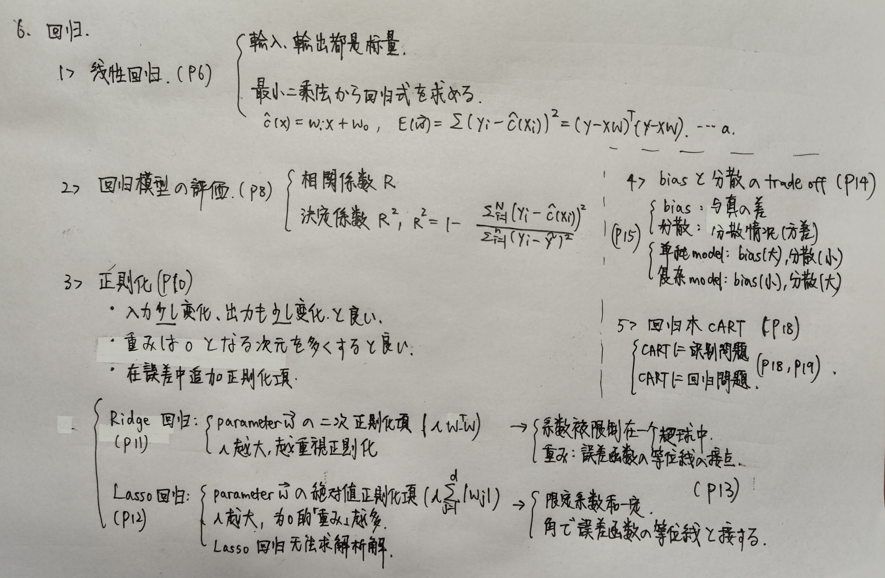

<!-- Created by Frank -->

- [机器学习\_概念\_2](#机器学习_概念_2)
  - [6 回帰](#6-回帰)
    - [線形回帰 (P6)](#線形回帰-p6)
    - [回帰モデルの評価 (P8)](#回帰モデルの評価-p8)
    - [評価指標 (P8)](#評価指標-p8)
      - [相関係数 (P8)](#相関係数-p8)
      - [決定係数 (P8)](#決定係数-p8)
    - [正則化 (P10)](#正則化-p10)
    - [Ridge回帰 (P11)](#ridge回帰-p11)
    - [Lasso回帰 (P12)](#lasso回帰-p12)
      - [Lasso回帰の解は、解析的に求められない (P12)](#lasso回帰の解は解析的に求められない-p12)
    - [正則化の振る舞い (P13)](#正則化の振る舞い-p13)
      - [1. Ridge回帰](#1-ridge回帰)
      - [2. Lasso回帰](#2-lasso回帰)
    - [バイアスと分散のトレードオフ(trade off) (P15)](#バイアスと分散のトレードオフtrade-off-p15)
      - [1. バイアス: 真のモデルとの距離](#1-バイアス-真のモデルとの距離)
      - [2. 分散: 学習結果の散らばり具合](#2-分散-学習結果の散らばり具合)
      - [a. 単純なモデル: バイアス: ⼤、分散: ⼩](#a-単純なモデル-バイアス-分散-)
      - [b. 複雑なモデル: バイアス: ⼩、分散: ⼤](#b-複雑なモデル-バイアス-分散-)
    - [機械学習では、バイアスー分散のトレードオフを常に意識 (P16)](#機械学習ではバイアスー分散のトレードオフを常に意識-p16)
    - [回帰木 CART (P17)](#回帰木-cart-p17)
      - [CARTによる識別問題 (P18)](#cartによる識別問題-p18)
      - [CARTによる回帰問題 (P19)](#cartによる回帰問題-p19)
    - [モデル⽊ (P20)](#モデル-p20)
  - [7 サポートベクトルマシン](#7-サポートベクトルマシン)
    - [正解率100%で識別できる識別⾯が無数に存在 (P5)](#正解率100で識別できる識別が無数に存在-p5)
    - [マージン (P5)](#マージン-p5)
    - [サポートベクトルマシン (P6)](#サポートベクトルマシン-p6)
    - [サポートベクトルマシンの定式化 (P9)](#サポートベクトルマシンの定式化-p9)
    - [ラグランジュ未定乗数法 (P12)](#ラグランジュ未定乗数法-p12)
    - [識別⾯の計算 (P12 - 16)](#識別の計算-p12---16)
    - [サポートベクトル (P16)](#サポートベクトル-p16)
    - [ハードマージン (P17)](#ハードマージン-p17)
    - [ソフトマージン (P17)](#ソフトマージン-p17)
    - [C (P18)](#c-p18)
    - [カーネル関数 (P22)](#カーネル関数-p22)
    - [類似度関数 (这个就是 kernel 函数) (P23)](#類似度関数-这个就是-kernel-函数-p23)
    - [カーネルトリック (P26)](#カーネルトリック-p26)
    - [カーネル法 (P27)](#カーネル法-p27)
    - [強⼒ SVM (P27)](#強-svm-p27)
  - [8 ニューラルネットワーク](#8-ニューラルネットワーク)
    - [neural network (P5)](#neural-network-p5)
    - [活性化関数（神経細胞）(P6)](#活性化関数神経細胞p6)
    - [nn と 単層パーセプトロン の違い (P7)](#nn-と-単層パーセプトロン-の違い-p7)
    - [シグモイド関数 (P7)](#シグモイド関数-p7)
    - [3階層のフィードフォワード型モデル (P11)](#3階層のフィードフォワード型モデル-p11)
    - [誤差逆伝播法 (P13)](#誤差逆伝播法-p13)
    - [重み w の学習 (P14)](#重み-w-の学習-p14)
    - [勾配消失問題 (P20)](#勾配消失問題-p20)
    - [勾配消失問題の解決⼿段 (P20)](#勾配消失問題の解決段-p20)
    - [ReLU（rectified linear unit）(P21)](#relurectified-linear-unitp21)
  - [9 深層学習](#9-深層学習)
    - [深層学習 (P5)](#深層学習-p5)
    - [表現学習 (P6)](#表現学習-p6)
    - [DNNのモデル (P7)](#dnnのモデル-p7)
      - [1. 多階層ニューラルネットワークの構成 (P8)](#1-多階層ニューラルネットワークの構成-p8)
      - [2. 損失関数 (P9)](#2-損失関数-p9)
      - [3. 重みを修正する最適化器 (P10)](#3-重みを修正する最適化器-p10)
    - [事前学習法 (P12)](#事前学習法-p12)
    - [オートエンコーダ (Auto-encoder) (P14)](#オートエンコーダ-auto-encoder-p14)
    - [ドロップアウト (P16)](#ドロップアウト-p16)
    - [畳み込みニューラルネットワーク (P18)](#畳み込みニューラルネットワーク-p18)
      - [畳み込み層 (P19)](#畳み込み層-p19)
      - [プーリング層 (P20)](#プーリング層-p20)
      - [リカレントニューラルネットワーク (P21)](#リカレントニューラルネットワーク-p21)
      - [⻑・短期記憶 LSTM (P23)](#短期記憶-lstm-p23)
  - [10 アンサンブル学習](#10-アンサンブル学習)
    - [アンサンブル学習 集成学习 (P5)](#アンサンブル学習-集成学习-p5)
    - [バギング bagging (P8)](#バギング-bagging-p8)
    - [ランダムフォレスト (P12)](#ランダムフォレスト-p12)
    - [ランダムフォレストの学習⽅法 (P13)](#ランダムフォレストの学習法-p13)
    - [ブースティング boosting (P15)](#ブースティング-boosting-p15)
    - [AdaBoost (P16)](#adaboost-p16)
    - [勾配ブースティング (P19)](#勾配ブースティング-p19)

# 机器学习_概念_2

## 6 回帰

 

### 線形回帰 (P6)

* 最も単純な⼊⼒も出⼒もスカラー (scale，标量) である場合の回帰問題を考える
* 最⼩⼆乗法から回帰式を求める

### 回帰モデルの評価 (P8)

* 回帰式が未知データに対して正しく出⼒値を予測するかを評価

### 評価指標 (P8)

#### 相関係数 (P8)

* 正解と予測が、どの程度似ているのか
  
  #### 決定係数 (P8)

* 「正解との離れ具合」と「平均との離れ具合」の⽐を1から引く

### 正則化 (P10)

* 汎化能⼒という点では、⼊⼒が少し変化したときに、出⼒も少し変化する回帰式が良い
* 線形回帰の重みは、値が 0 となる次元を多くすれば良い
* 誤差関数の式に正則化項を追加する

### Ridge回帰 (P11)

* パラメータ w の⼆乗を正則化項とする
* パラメータの値が⼩さくなるように正則化させる
* 重みが⼤きければ、性能よりも正則化の結果を重視

### Lasso回帰 (P12)

* パラメータ の絶対値を正則化項とする

* 値を 0 とするパラメータが多くなるように正則化される

* 𝜆 正則化項の重み。⼤きければ、値を0とする重みが多くなる
  
  #### Lasso回帰の解は、解析的に求められない (P12)

* 原点で微分不可能な絶対値を含むため

### 正則化の振る舞い (P13)

#### 1. Ridge回帰

* 系数被限制在⼀个超球中

* パラメータの存在する範囲を円（ 次元では超球）の中に限定して、それぞれの重みが⼤きな値をとれないようにする

* 重み: 誤差関数の等位線との接点（＝円周上の点）
  
  #### 2. Lasso回帰

* 限定系数和⼀定

* それぞれの軸で⾓をもつ領域に値が制限

* ⾓で誤差関数の等位線と接する（多くのパラメータが0になる）

### バイアスと分散のトレードオフ(trade off) (P15)

#### 1. バイアス: 真のモデルとの距離

#### 2. 分散: 学習結果の散らばり具合

* 分散越小，当输⼊变化时，输出变化越小
  
  #### a. 単純なモデル: バイアス: ⼤、分散: ⼩

* 线性回归式
  
  #### b. 複雑なモデル: バイアス: ⼩、分散: ⼤

* 高次回归式 (data个数 - 1)

### 機械学習では、バイアスー分散のトレードオフを常に意識 (P16)

* 正則化: 緩いバイアスで分散を減らすのに有効

### 回帰木 CART (P17)

* 識別における決定⽊の考え⽅を回帰問題に適⽤する⽅法

* ⽊の構造を⼆分⽊に限定した決定⽊

* 分類基準: ジニ不純度（Gini impurity）
  
  #### CARTによる識別問題 (P18)

* 选择G变化值最⼤的分类
  
  #### CARTによる回帰問題 (P19)

* 选择SS减少量最⼤的分类

* SS(D) では、データD の分散を求めているので、この基準は分割後の分散が最⼩となるような分割を求めている

### モデル⽊ (P20)

* 回帰⽊のリーフの値を線形回帰式とした⽊

## 7 サポートベクトルマシン

### 正解率100%で識別できる識別⾯が無数に存在 (P5)

### マージン (P5)

* 識別⾯と最も近いデータとの距離
* 汎化能⼒の⾼さを定量的に表現
* マージンが広いと、学習データと識別⾯の間に未知データが⼊る余地がある

### サポートベクトルマシン (P6)

* マージンが最⼤となる識別⾯を求める⼿法
* 学習データが線形分離可能な状況を仮定
* 2値分類問題に限定
  * 正例: y = 1
  * 負例: y = -1

### サポートベクトルマシンの定式化 (P9)

* 識別⾯に最も近いデータを識別⾯の式に代⼊したときその絶対値が 1 になるように係数 w と w0 を調整
* 学習パターンと識別⾯との最⼩距離は minDist(xi) = 1 / ||w||
* この最⼩距離は「マージン」を表している
* マージンを最⼤にする == ||w|| を最⼩化する問題となる == w2 を最⼩化する問題となる
* 全学習データを識別できるという条件を追加
  * y*(w*x + w0) >= 1
  * 保证正样本和负样本能够同时正确判别

### ラグランジュ未定乗数法 (P12)

* g(x) = 0 の条件下で f(x) の最⼩値（または最⼤値）を計算する⼿法
* ラグランジュ関数 L(x, lamda) = f(x) - lamda*g(x) を導入
* ラグランジュ乗数 ai を導⼊して、转换为下面的式子 (P14)
  * L(w, w0, a) = 1/2*||w||^2 - sum(ai{y*(w*x + w0) - 1})

### 識別⾯の計算 (P12 - 16)

### サポートベクトル (P16)

* 識別⾯の計算に寄与する学習データ

### ハードマージン (P17)

* 全データを正しく識別できる条件

### ソフトマージン (P17)

* ハードマージンを弱める変数を導⼊

### C (P18)

* C は制約を満たさないデータを、どの程度の重みで最適化に組み込むかを決定する定数

### カーネル関数 (P22)

* データが⾼次元空間上に疎らに分布することになるので、線形識別⾯が存在する可能性が⾼くなる
* データが⾼次元空間上に疎らに分布することになるので、線形識別⾯が存在する可能性が⾼くなる
* 元の空間におけるデータ間の距離関係を保存しながら
* ⾼次元空間上での線形識別器の性能は 元の空間での複雑な⾮線形識別器の性能に相当する
* 元の分布の性質が壊されやすくなる

### 類似度関数 (这个就是 kernel 函数) (P23)

* 2点 x, x' が近いほど、K は⼤きな値になる
* 求まる⾼次元ベクトルの内積によって、類似度関数の値を計算できる
* この関数をカーネル関数と呼ぶ

### カーネルトリック (P26)

* 複雑な⾮線形写像を求める操作を避ける⽅法

### カーネル法 (P27)

* ⼊⼒データを⾼次元空間に写像しながら、計算上は明⽰的に⾼次元空間を考えずに識別⾯を構成できる

### 強⼒ SVM (P27)

* ⾮線形写像で線形分離可能な⾼次元空間にデータを⾶ばして、マージン最⼤化基準で信頼できる識別⾯を求めるSVMは⾮常に強⼒
* ⽂書分類 や バイオインフォマティックス (生物信息学) などの様々な分野（特に⾼次元識別問題）で利⽤

## 8 ニューラルネットワーク

### neural network (P5)

* 下図のような計算ユニットを階層的に組み合わせて、⼊⼒から出⼒を計算するメカニズム
* 多層パーセプトロン (P9)
* パーセプトロンをノードとして、階層状に結合した (P9)
* ⾮線形識別⾯を実現 (P9)

### 活性化関数（神経細胞）(P6)

* 重み付き和を代⼊し、その出⼒信号o を出⼒する

### nn と 単層パーセプトロン の違い (P7)

* 閾値関数 的不同
  * 单层感知机: step 函数
  * neural network: sigmoid 函数

### シグモイド関数 (P7)

* 微分可能
* 誤差逆伝搬法を利⽤できる

### 3階層のフィードフォワード型モデル (P11)

* ⼊⼒層
  * ノード数 ＝ 特徴ベクトルの次元数
* 出⼒層
  * ノード数 ＝ 識別対象のクラス数
* 中間層
  * ノード数 ＝ ⼊⼒層と出⼒層のノード数に応じた適当な数

### 誤差逆伝播法 (P13)

* 出⼒層の誤差を計算し、その誤差を中間層に伝播させて学習する⼿法

### 重み w の学習 (P14)

* 誤差の⼆乗和 E(w)
* 最急勾配法を⽤いて、重み w を学習

### 勾配消失問題 (P20)

* 中間層の階層を深くした多層ネットワークに対して誤差逆伝播法によって重みを学習したときに、重みの修正量が⼊⼒層の⽅向へ戻るにつれて⼩さくなる問題

### 勾配消失問題の解決⼿段 (P20)

* 事前学习法
* 在活性化函数上下功夫

### ReLU（rectified linear unit）(P21)

* 半分の領域で勾配が1 (誤差が消失しない)
* 勾配を⾼速に計算できる (0または1)

## 9 深層学習

### 深層学習 (P5)

* 特徴抽出前の信号を⼊⼒とする多階層ニューラルネットワークの学習
* DNN: Deep Neural Network

### 表現学習 (P6)

* 特徴抽出前の⽣データに近い信号から、その内容を表現する特徴を学習する
* どのような特徴を抽出するのかも、データから学習する (提取什么特征也需要从数据中学习)

### DNNのモデル (P7)

#### 1. 多階層ニューラルネットワークの構成 (P8)

#### 2. 損失関数 (P9)

#### 3. 重みを修正する最適化器 (P10)

* 最急勾配法に加えるモーメンタム (momentum)
  * 1時刻前の勾配ベクトルを重み付きで加える⽅法
* adam (adaptive moment estimation)
  * 指数平滑移動平均
* AdaGrad
  * 学習係数を⾃動調整
* RMSProp
  * 指数移動平均

### 事前学習法 (P12)

* 何らかの⽅法で重みの初期パラメータを適切なものに事前調整する
* ノードの数が減るので、特徴となる情報を保持しつつ、階層を重ねながら、抽象度の ⾼い情報表現を獲得することが深層学習のアイデア

### オートエンコーダ (Auto-encoder) (P14)

* 事前学習の⼀つで、⼊⼒ の情報をなるべく失わず、より少ないノードへの写像を学習する⼿段

### ドロップアウト (P16)

* 各層のユニットを⼀定の割合でランダムに無効化して学習
* ドロップアウトで過学習を产生的概率减小

### 畳み込みニューラルネットワーク (P18)

* CNN

* 畳み込み層と、プーリング層を交互に配置

* 全結合のニューラルネットワークを最終出⼒側に配置
  
  #### 畳み込み層 (P19)

* 画像のフィルタリングに相当する処理を⾏う層

* 各フィルタのフィルタ係数を学習
  
  #### プーリング層 (P20)

* 注⽬領域内の平均、あるいは最⼤値を出⼒する層

* 領域内のパターンの位置変化を吸収
  
  #### リカレントニューラルネットワーク (P21)

* RNN 循环神经网络

* 中間層の出⼒が時間遅れで⾃分⾃⾝に戻ってくる構造を もつネットワーク

* 時系列信号や⾃然⾔語などの系列パターンに対して有効

* ⼊⼒層からの情報に加えて ⼀つ前の中間層の活性化状態を⼊⼒とする
  
  #### ⻑・短期記憶 LSTM (P23)

* 中間層のユニットを記憶構造にもつ特殊なメモリユニット（LSTMセル）に置き換える⽅法

* 3つのゲート
  
  * ⼊⼒ゲート
  * 出⼒ゲート
  * 忘却ゲート

* 学習時には、誤差もゲートで制御される

## 10 アンサンブル学習

### アンサンブル学習 集成学习 (P5)

* 識別器を複数組み合わせ、それらの結果を統合することで個々の識別器よりも性能を向上させる⽅法
* アンサンブル学習は「いかにして独⽴な識別器を作るか︖」がポイント
* 多数決

### バギング bagging (P8)

* 学習データから復元抽出することで、もとのデータと同じサイズの独⽴なデータ集合を複数作成し、各々のデータ集合に対して同じアルゴリズムで識別器を作成する⽅法
* 不安定（学習データの違いに敏感）な⽅が良い (P10)  
* 少しデータが異なるだけで、異なった識別器になる (P10)
* 多数決

### ランダムフォレスト (P12)

* 複数の決定⽊を統合したアンサンブル学習⼿法
* バギングアルゴリズム以上に、異なる決定⽊が⽣成されるような様々な仕組みを導⼊
* 多数決

### ランダムフォレストの学習⽅法 (P13)

### ブースティング boosting (P15)

* 誤りを減らすために、特化した重みを与えたデータのもとでそれぞれの識別器を作成
* 重み付き投票から識別結果を求め

### AdaBoost (P16)

* 重み付きデータと重み付き識別器を⽤いる⼿法
* 誤識別されたデータの重みの和 と 正しく識別されたデータの重みの和 を等しくする

### 勾配ブースティング (P19)

* 損失が最も減るような識別器を直接加える処理を逐次的に⾏う⼿法
* 損失関数の最⼩化の部分を、損失関数の勾配として、新しい識別器を構成するのが勾配ブースティング